:::note[v0.1.0 vs this document]
This document describes the *v1.0 target* — the system you'd build if you were standing up a bank-grade internal platform from scratch. **Plinth v0.1.0 implements §14 (Cerbos), §20 (CloudNativePG), §25 (OpenTelemetry) end-to-end; the substrate chart and SDKs reference this architecture, not the whole of it.** The [v0.1.0 launch page](/launch/v0-1-0/) lists what ships today.
:::

## How to read this document

A reference for organisations standing up an **internal application platform** — a fleet of related modules that share authentication, authorisation, observability, audit, and deployment infrastructure. The patterns described are what you'd choose if you were starting fresh today, with banking-grade defaults and an open-source budget. Audience: platform engineering leads, infrastructure engineers, information security, compliance, and application developers.

Five audiences, five entry points:

| Audience | Read first |
| --- | --- |
| **Executive sponsor / CIO** | §1 Executive summary, §2 Sector context, §59 Roadmap, §62 Logical architecture diagram |
| **Tech leads** | §3 Common pitfalls, Parts II–IV, Part VII (paired starter kits) |
| **Infrastructure engineers** | Part II, §11 Storage, §51 Backup & DR |
| **Information security** | Part III, §33 SIEM, §49 Compliance mapping |
| **Application developers** | Part VI, Part VII |

The paired starter kits — [`starter-web`](https://github.com/plinth-dev/starter-web) (Next.js frontend) and [`starter-api`](https://github.com/plinth-dev/starter-api) (Go backend) — implement the patterns in this document. They are clone-ready scaffolds for new modules.

---

## Table of contents

**Part I — Foundations**
1. [Executive summary](#1-executive-summary)
2. [Sector context — when this architecture fits](#2-sector-context)
3. [Common pitfalls in v1-style starter templates](#3-common-pitfalls)
4. [Design principles](#4-design-principles)

**Part II — Reference Architecture**
5. [Logical architecture overview](#5-logical-architecture-overview)
6. [Network topology and zoning](#6-network-topology-and-zoning)
7. [Hardware sizing and bill of materials](#7-hardware-sizing-and-bill-of-materials)
8. [Kubernetes distribution — Talos Linux](#8-kubernetes-distribution--talos-linux)
9. [CNI and service mesh — Cilium](#9-cni-and-service-mesh--cilium)
10. [Ingress — Traefik v3 and cert-manager](#10-ingress--traefik-v3-and-cert-manager)
11. [Storage — Rook-Ceph and MinIO](#11-storage--rook-ceph-and-minio)
12. [Load balancing — MetalLB](#12-load-balancing--metallb)

**Part III — Identity, Authorization, Secrets, PKI**
13. [Identity — Ory stack (Kratos · Hydra · Oathkeeper)](#13-identity--ory-stack)
14. [Authorization — Cerbos as policy decision point](#14-authorization--cerbos)
15. [Secrets — HashiCorp Vault](#15-secrets--hashicorp-vault)
16. [Public-key infrastructure](#16-public-key-infrastructure)
17. [mTLS and zero-trust east–west](#17-mtls-and-zero-trust)

**Part IV — Application Platform**
18. [Workflow engine — Temporal](#18-workflow-engine--temporal)
19. [Event streaming — NATS JetStream](#19-event-streaming--nats-jetstream)
20. [Database — CloudNativePG](#20-database--cloudnativepg)
21. [Cache — Redis Sentinel](#21-cache--redis-sentinel)
22. [Search — OpenSearch](#22-search--opensearch)
23. [Object storage — MinIO](#23-object-storage--minio)
24. [API gateway pattern](#24-api-gateway-pattern)

**Part V — Observability and Audit**
25. [OpenTelemetry instrumentation standard](#25-opentelemetry-instrumentation-standard)
26. [Metrics — Prometheus and Thanos](#26-metrics--prometheus-and-thanos)
27. [Logs — Grafana Loki](#27-logs--grafana-loki)
28. [Traces — Grafana Tempo](#28-traces--grafana-tempo)
29. [Profiling — Grafana Pyroscope](#29-profiling--grafana-pyroscope)
30. [Grafana — single pane of glass](#30-grafana--single-pane-of-glass)
31. [Alerting](#31-alerting)
32. [Audit log architecture](#32-audit-log-architecture)
33. [SIEM — Wazuh](#33-siem--wazuh)
34. [Runtime security — Falco](#34-runtime-security--falco)
35. [Image scanning — Trivy Operator](#35-image-scanning--trivy-operator)
36. [Policy enforcement — Kyverno](#36-policy-enforcement--kyverno)

**Part VI — Developer Experience**
37. [Source control — GitLab CE](#37-source-control--gitlab-ce)
38. [Continuous integration](#38-continuous-integration)
39. [GitOps continuous delivery — Argo CD](#39-gitops-continuous-delivery--argo-cd)
40. [Container registry and supply-chain security](#40-container-registry-and-supply-chain-security)
41. [Developer portal — Backstage](#41-developer-portal--backstage)
42. [Module scaffolder](#42-module-scaffolder)
43. [Test infrastructure](#43-test-infrastructure)
44. [Documentation strategy](#44-documentation-strategy)

**Part VII — The starter kits**
45. [Frontend — `starter-web`](#45-frontend--starter-web)
46. [Backend — `starter-api`](#46-backend--starter-api)
47. [Shared libraries](#47-shared-libraries)
48. [Authorization-policy repository](#48-authorization-policy-repository)

**Part VIII — Compliance and Operations**
49. [Compliance mapping](#49-compliance-mapping)
50. [Data classification](#50-data-classification)
51. [Backup and disaster recovery](#51-backup-and-disaster-recovery)
52. [Incident response](#52-incident-response)
53. [Secret rotation](#53-secret-rotation)
54. [Vulnerability management](#54-vulnerability-management)

**Part IX — Roadmap**
55. [Phase 0 — substrate (weeks 1–4)](#55-phase-0--substrate-weeks-14)
56. [Phase 1 — platform services (weeks 5–10)](#56-phase-1--platform-services-weeks-510)
57. [Phase 2 — workflow + security (weeks 11–16)](#57-phase-2--workflow--security-weeks-1116)
58. [Phase 3 — starter kits + first migration (weeks 17–22)](#58-phase-3--starter-kits--first-migration-weeks-1722)
59. [Phase 4 — fleet rollout (weeks 23–28)](#59-phase-4--fleet-rollout-weeks-2328)
60. [Cost and effort summary](#60-cost-and-effort-summary)
61. [Risks and mitigations](#61-risks-and-mitigations)

**Part X — Diagrams**
62. [Logical architecture](#62-logical-architecture-diagram)
63. [Network topology](#63-network-topology-diagram)
64. [Cluster topology](#64-cluster-topology-diagram)
65. [Request lifecycle](#65-request-lifecycle-diagram)
66. [Workflow engine sequence](#66-workflow-engine-sequence-diagram)
67. [CI/CD pipeline](#67-cicd-pipeline-diagram)
68. [Secret-rotation flow](#68-secret-rotation-flow-diagram)
69. [Audit-log lifecycle](#69-audit-log-lifecycle-diagram)
70. [Identity flow](#70-identity-flow-diagram)
71. [Backup and DR flow](#71-backup-and-dr-flow-diagram)

---

## Part I — Foundations

## 1. Executive summary

This is a reference architecture for the **next generation of enterprise internal-tooling platforms** — the kind of system that hosts a fleet of internal modules (project management, HR tooling, change management, audit dashboards, and so on) used by staff every day, sharing a common authentication, authorisation, observability, and deployment substrate.

It assumes:
- A workload tier that is **internal-facing, not customer-facing** — concurrency in the hundreds, not millions.
- An organisation operating in a **regulated context** — banking, finance, healthcare, government — where audit trails, retention guarantees, and compliance evidence are first-class concerns.
- **On-premise or private-cloud deployment** — data residency, regulator constraints, or vendor-independence reasons make public cloud the wrong default.
- **Open-source-first** budget — every recommendation here is permissively-licensed and self-hostable. Commercial support is welcome but never required.

The reference covers the full stack from physical hardware to developer portal, with technology choices and the rationale behind each. The total infrastructure footprint for a production-grade deployment fits in **two server racks** of mid-range commodity hardware; the management cluster fits in a third. Annual incremental software cost is effectively zero.

The proposed implementation timeline is **28 weeks across five phases** with parallel tracks: substrate → platform services → workflow + security → starter kits + pilot migration → fleet rollout. Each phase has explicit exit criteria.

The result is a platform where:
- A new module reaches *deployed in dev* in under five minutes via a developer-portal scaffolder.
- Every action is observable end-to-end (trace, metric, log, audit) and every audit event is WORM-stored for the regulator-mandated retention window.
- No credentials live in source control; secrets are dynamically issued by Vault and rotated automatically.
- No deployment touches production without passing image scanning, SAST, contract tests, and a progressive canary rollout.
- Compliance evidence is generated as a byproduct of running the platform — not as a separate audit project.

## 2. Sector context

The patterns in this document are shaped for organisations whose internal IT must produce evidence — for regulators, internal auditors, risk teams — even when the modules in question do not directly process customer data.

### 2.1 Regulatory landscape

Where applicable, the platform is designed to produce evidence (or at minimum, not impede the production of evidence) for the following regimes. The list is illustrative; substitute your own.

| Regime | Relevance | Platform implication |
| --- | --- | --- |
| **ISO/IEC 27001:2022** | International ISMS standard. Annex A controls span identity, logging, supplier management, vulnerability management. | Centralised IAM, SIEM, vulnerability management, incident response. |
| **PCI-DSS v4** | Applies if card data ever transits a module. Even when the answer is "no", design must keep the option open via network segmentation. | Cardholder-data zone is a separate VLAN behind dedicated firewall rules; modules cross it only after explicit assessment. |
| **Local banking / financial regulator guidance** | Most jurisdictions have an equivalent of "sound IT risk management, segregation of duties, change control, audit trails, BCP". | Workflow engine with enforced approvals; immutable audit log; documented DR; access reviews. |
| **GDPR-equivalent privacy regimes** | Data-subject rights, lawful basis, data-minimisation, retention. | Data classification, retention policies, right-to-erasure honored via soft-delete + scheduled purge. |
| **Data residency** | Bank/government/healthcare policies often require certain classes of data not to leave the primary jurisdiction. | All components in this reference are self-hostable on-premise; no cloud dependency required. |

### 2.2 Workload characteristics

This architecture targets the following shape:

- **Internal user base** in the hundreds to low thousands. Not customer-facing. Concurrency rarely exceeds a few hundred active users per module.
- **Multi-stage approval workflows** as a central business pattern. Lifecycle states with required approvals at designated roles. Examples: change-request approval, risk-review sign-off, post-implementation review.
- **Role hierarchy** that maps to the organisation's seniority structure. Typically 5–8 tiers from individual contributor to executive, with cross-cutting functional roles (quality, security, compliance).
- **External integrations** with HR, ITSM, ticketing, and similar enterprise systems.
- **Document-heavy** — change requests carry attachments; audit reports include evidence files.
- **Multi-language potential** — at least one secondary language alongside English, possibly with right-to-left text support.

### 2.3 Non-functional priorities

Ranked, with the rationale this document is designed around:

1. **Auditability** — every state change attributable to a user, with timestamp and reason, retained for the regulator-mandated window (typically 7 years for financial events; 1 year operational baseline).
2. **Availability** — RTO 4 hours, RPO 15 minutes for production modules. Internal-tooling tier; not 24×7 customer-facing.
3. **Security** — zero standing privileged access; secrets rotated; defence in depth; runtime anomaly detection.
4. **Developer velocity** — a new module reaches dev deployment in under a day from idea to running pod. In a typical greenfield organisation this is measured in weeks.
5. **Operational legibility** — a single operator on call can triage any module from one Grafana dashboard.

## 3. Common pitfalls in v1-style starter templates

Most internal-tooling platforms grow organically. The first module gets a starter template; the second module clones it; ten modules later the template is the canonical scaffold every cloned module inherits — including its mistakes. The common pitfalls are:

| Theme | Examples | This architecture's response |
| --- | --- | --- |
| **Committed secrets** | A working JWT signing key in `.env.example`. CORS middleware with `*` origin. Hard-coded dev credentials. | No secrets in source. `.env.example` is placeholders only. Vault dynamic credentials. |
| **Doc/code drift** | README claims "X components included" — actual count differs. State-management library promised but not wired. | Single source of truth; type-checked exports; CI lints docs against code. |
| **Production-missing pieces** | No tests, no CI, no error boundaries, no security headers, no real healthcheck, no migration tool, AutoMigrate vs. SQL-migrations contradiction. | All shipped from day one in the starter kits. |
| **Observability gaps** | Single request log line; no traces, no metrics, no centralised logs. | Full LGTM stack + OpenTelemetry from first commit. |
| **Authorization landmines** | Dev-mode "auto-allow" that silently grants everything if the PDP is unreachable. Inconsistent env-var names across services. | Fail-closed by default; opt-in dev bypass with loud warnings; canonical env-var schema. |
| **Workflow ad-hocism** | Each module reinvents `workflow_stages`, `workflow_transitions`, `approvals` SQL tables; transitions not enforced at DB level; race conditions possible. | Temporal as a durable workflow engine; UI components are thin views over Temporal queries. |
| **Onboarding friction** | "TODO: Customize" mentioned but not annotated; cross-repo customisation checklists incomplete; unfamiliar tooling. | Backstage scaffolder generates a fully wired module from a form. |

The starter kits paired with this document close every item above explicitly.

## 4. Design principles

The six commitments are stated normatively in the [manifesto](/manifesto/) — *zero standing trust*, *GitOps everything*, *immutable infrastructure*, *durable workflows*, *evidence by default*, *open source first*. They are the contract; this document is the *how*.

Where a section deviates from one, the deviation is named explicitly in that section.

---

## Part II — Reference Architecture

## 5. Logical architecture overview

The platform is organised into seven logical zones. Each zone is a distinct trust and operational domain; traffic between zones traverses a policy point.

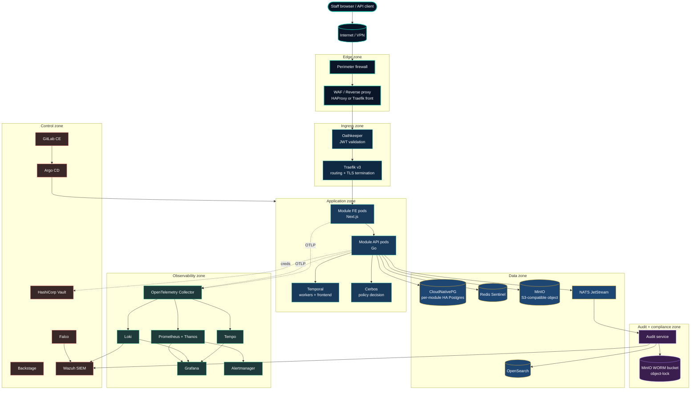

### 5.1 Zone responsibilities

| Zone | Owns | Trust boundary |
| --- | --- | --- |
| **Edge** | TLS termination at perimeter, WAF, DDoS mitigation, public IP. | Untrusted ingress; everything is verified beyond. |
| **Ingress** | Identity establishment (Oathkeeper), routing (Traefik), per-request rate limiting. | Trusts that traffic is HTTPS and originates from edge; verifies tokens. |
| **Application** | Module frontends (Next.js), backends (Go), workflow workers (Temporal), policy decisions (Cerbos). | Trusts authenticated identity from ingress; calls Cerbos for every authorisation decision; calls Vault for credentials. |
| **Data** | Stateful services (Postgres, Redis, MinIO, OpenSearch, NATS). | Reachable only from application zone via mTLS; per-module credentials. |
| **Audit + compliance** | Audit service, WORM-locked event store, retention policy enforcement. | Append-only; no service may delete or mutate; only the compliance team may export. |
| **Observability** | Metrics, logs, traces, profiles, dashboards, alerting. | Receives passive telemetry; never modifies application state. |
| **Control** | Vault, Argo CD, Backstage, GitLab, Wazuh, Falco. | Highest privilege; access via just-in-time approval; mgmt cluster physically separate. |

## 6. Network topology and zoning

The platform substrate is segmented into four VLANs, with stricter firewall rules between them than within:

| VLAN | Purpose | Examples |
| --- | --- | --- |
| **DMZ** | Internet-facing edge | Perimeter firewall, WAF, public load balancer |
| **APP** | Application + data clusters | All worker nodes, all stateful services |
| **MGMT** | Control plane and management cluster | K8s control planes, Vault, GitLab, Argo CD, Backstage, Wazuh |
| **OPS** | Operator workstations + jump hosts | Engineers' bastions, build machines |

Inter-VLAN rules (default deny):

- **DMZ → APP**: only HTTPS:443 to the ingress IP; nothing else.
- **APP → APP** (within): allowed; further constrained by Cilium NetworkPolicy at pod level (default deny + per-namespace allowlist).
- **APP → MGMT**: outbound to Vault (8200), GitLab Registry (443), OTel collectors. Inbound denied.
- **MGMT → APP**: only Argo CD reconciliation outbound; inbound from monitoring agents.
- **OPS → MGMT**: SSH to bastions only (which then proxy `kubectl`); zero-trust just-in-time elevation via Vault.
- **OPS → APP/DMZ**: denied. Engineers never touch app-zone hosts directly.

Intra-VLAN microsegmentation is enforced by **Cilium NetworkPolicy** on the K8s side: every namespace starts default-deny; allow rules are declared in the GitOps repo. Cilium L7 policies further restrict by HTTP path or gRPC method where warranted (e.g., the audit service exposes `Append` to all but `Query` only to the compliance namespace).

## 7. Hardware sizing and bill of materials

### 7.1 Cluster topology

Three Kubernetes clusters across two physical racks plus a third management rack:

| Cluster | Purpose | Node roles |
| --- | --- | --- |
| **prod** | Production application + data workloads | 3 control-plane, 6 workers, 3 storage (Ceph) |
| **nonprod** | Dev + staging + testing | 3 control-plane, 4 workers, 2 storage |
| **mgmt** | Control & observability (Vault, GitLab, Argo, Backstage, LGTM, Wazuh) | 3 control-plane, 3 workers, 2 storage |

### 7.2 Per-node specifications (commodity 2U servers)

| Role | CPU | RAM | Storage | NIC | Notes |
| --- | --- | --- | --- | --- | --- |
| **Control plane** | 8 cores (e.g., AMD EPYC 7313P or Intel Xeon Silver 4314) | 32 GB ECC DDR4 | 2× 480 GB NVMe (RAID-1) | 2× 10 GbE | etcd is sensitive to disk latency; NVMe non-negotiable |
| **Worker** | 32 cores (AMD EPYC 7543P or equivalent) | 256 GB ECC DDR4 | 2× 480 GB NVMe (RAID-1, OS) + 2× 1.92 TB NVMe (local cache) | 2× 25 GbE | Sized for ~50 module pods/node + Temporal/observability headroom |
| **Storage (Ceph)** | 16 cores | 128 GB ECC DDR4 | 8× 7.68 TB NVMe (Ceph OSDs) + 2× 480 GB NVMe (OS RAID-1) | 2× 25 GbE + 2× 25 GbE cluster network | Three nodes give ~46 TB usable with replication factor 3 |

### 7.3 Networking & power

- **Top-of-rack switches**: two 48-port 25 GbE switches per rack with MLAG between them for redundancy.
- **Out-of-band management**: separate 1 GbE management network for IPMI/BMC.
- **Power**: dual feeds per rack from independent UPS circuits; nodes dual-PSU.
- **Time**: redundant NTP from internal stratum-1 (GPS-disciplined) servers; chrony on every node.

### 7.4 Cost envelope

These are list-price ballparks for three clusters, *excluding* existing rack/network investments. Exact procurement varies by vendor relationship and region.

| Item | Qty | Unit cost (USD) | Subtotal |
| --- | --- | --- | --- |
| Control-plane node | 9 | $4,500 | $40,500 |
| Worker node | 13 | $12,000 | $156,000 |
| Storage node | 8 | $18,000 | $144,000 |
| 25 GbE switch (TOR) | 6 | $8,000 | $48,000 |
| 1 GbE OOB switch | 3 | $1,500 | $4,500 |
| Cabling, PDUs, KVM | — | — | $20,000 |
| **Total CAPEX** | | | **~$413,000** |

OPEX (power, cooling, datacentre space, hardware vendor support contracts) is not included; existing facility costs apply.

### 7.5 Why three clusters

Splitting prod, nonprod, and mgmt is deliberate:

- **Blast radius.** A bad change in nonprod cannot impact prod; a misbehaving observability stack cannot saturate a production worker.
- **Compliance.** Production audit data lives only on the prod cluster's WORM bucket; mgmt-cluster operators cannot reach it without explicit grant.
- **Lifecycle.** Nonprod can be upgraded one minor K8s version ahead of prod for canarying; mgmt is upgraded last because it is the deployment substrate.

A two-cluster topology (prod + mgmt-as-nonprod) is workable at lower cost but is not recommended for a regulated workload.

## 8. Kubernetes distribution — Talos Linux

Recommendation: **Talos Linux** (sidero.dev), the API-managed Kubernetes OS.

### 8.1 Why Talos

- **No SSH, no shell.** The OS exposes only the Talos API (gRPC, mTLS-authenticated). There is no `bash` to drop into; therefore no filesystem-level configuration drift, no privilege escalation via shell, no incident-response procedure that involves `sudo`.
- **Declarative configuration.** Node config is a YAML manifest (`machineconfig`); applying it is an atomic operation. The state of the cluster is the state of the manifests.
- **Minimal attack surface.** ~12 binaries on the node total. No package manager, no `cron`, no `systemd` unit a user can add.
- **Immutable upgrades.** Upgrades replace the OS image atomically with rollback; no `apt upgrade` half-state.
- **Excellent K8s integration.** Maintained explicitly to track upstream Kubernetes; no distribution-specific quirks.

### 8.2 Alternatives considered

| Alternative | Verdict | Reason |
| --- | --- | --- |
| **Red Hat OpenShift** | Rejected | High licence cost; lock-in to Red Hat ecosystem. |
| **Rancher RKE2** | Acceptable second choice | Proven on bare metal, government-friendly, has SSH (operator familiarity). Use this if Talos's no-SSH model is judged operationally too aggressive. |
| **kOps / kubeadm + Ubuntu** | Rejected | Higher operational burden (patching, hardening, drift) for no benefit Talos doesn't provide. |
| **K3s** | Rejected for prod | Excellent for edge/dev; lightweight choices not suited to a multi-tenant production cluster. Acceptable for tiny dev clusters. |
| **Cloud managed (EKS/GKE/AKS)** | Out of scope | Data residency requirements rule out cloud as the primary substrate. Possible secondary site for DR — see §51. |

### 8.3 Talos operational notes

- Cluster bootstrap via `talosctl` from an operator workstation.
- Configuration generated by **Omni** (sidero.dev's free-for-self-hosted control plane) — provides a UI for cluster lifecycle, machine onboarding, secret rotation. Optional but recommended.
- Backups: etcd snapshots taken hourly to MinIO via cronjob; Talos `apply-config` manifests in git.

## 9. CNI and service mesh — Cilium

Recommendation: **Cilium** (cilium.io) as both the CNI plugin and the service mesh, replacing the typical "Calico for CNI + Linkerd for mesh" pairing.

### 9.1 Why Cilium

- **One project for two jobs.** Network policy, load balancing, encryption, observability, and L7 policies all from one operator. Less to learn, less to break.
- **eBPF-native.** Kernel-level packet processing, no sidecar overhead. Significantly lower latency than Istio's Envoy-sidecar model.
- **Identity-based policy.** Pod-to-pod allow/deny driven by Kubernetes labels and SPIFFE-style identity, not by IP addresses (which are ephemeral).
- **Hubble** — built-in observability: every flow is labelled, queryable, exportable to Grafana. Network problems become diagnosable in minutes.
- **Cluster Mesh** — first-class multi-cluster service discovery for the eventual prod-DR topology.

### 9.2 Configuration baselines

- **mTLS everywhere by default** via Cilium's transparent encryption (WireGuard mode).
- **NetworkPolicy default-deny** in every namespace; allow rules in GitOps.
- **L7 policy** for sensitive endpoints (e.g., the audit service's `Query` API restricted to compliance namespace).
- **Hubble Relay** exposes flow data to Grafana via the Hubble exporter.

### 9.3 Alternatives considered

| Alternative | Verdict |
| --- | --- |
| **Calico + Linkerd** | Mature; Linkerd is operationally simple. Acceptable second choice. Not chosen because Cilium subsumes both. |
| **Istio** | Rejected. Operationally heavy; Envoy sidecar tax; complex for typical enterprise scale. |
| **Cilium without service-mesh features** + **Linkerd** | Workable but doubles the operator burden for no functional gain over Cilium-only. |

## 10. Ingress — Traefik v3 and cert-manager

Recommendation: **Traefik v3** as the K8s ingress, paired with **cert-manager** for automated TLS issuance.

### 10.1 Why

- **Operator familiarity** in many enterprise teams.
- **First-class K8s Gateway API support** in v3.
- **cert-manager** integrates with Vault PKI (§16) for internal certs and with public ACME issuers (Let's Encrypt) for any externally-exposed surface.

### 10.2 Routing model

- One Traefik IngressRoute per module per environment.
- Oathkeeper sits in front as a forward-auth middleware: Traefik calls Oathkeeper's `/decisions` endpoint, which returns 200 (with the JWT injected) or 401.
- Per-route rate limits via Traefik middleware; circuit-breaker plugin for misbehaving upstream pods.

## 11. Storage — Rook-Ceph and MinIO

Recommendation: **Rook-Ceph** for all in-cluster block (PVCs) and shared filesystem needs; **MinIO** as the canonical S3-compatible object store for application data.

### 11.1 Why split

- **Block storage** (Postgres data, Redis AOF, etcd snapshots) wants low-latency local-ish NVMe with replication; Ceph RBD on dedicated storage nodes is the proven open-source answer.
- **Object storage** (audit WORM, document attachments, container image cache, Loki chunks, Tempo blocks, backups) wants S3 semantics and elastic scale; MinIO is purpose-built for this and has an excellent operator.

### 11.2 Topology

- 3 storage nodes per cluster running both Ceph OSDs and MinIO pods.
- Ceph cluster: replication factor 3, EC profile available for cold data.
- MinIO: distributed deployment with parity 4+2; **object lock + WORM** enabled on the audit bucket per §32.

### 11.3 Alternatives considered

| Alternative | Verdict |
| --- | --- |
| **Longhorn** | Operationally simpler than Ceph but doesn't scale as well for high-throughput object workloads. Acceptable for nonprod / mgmt cluster. |
| **OpenEBS** | Lightweight; strong for dev but lacks Ceph's maturity for prod. |
| **NFS via TrueNAS** | Used widely; works for low-IO workloads but doesn't satisfy K8s-native dynamic provisioning needs cleanly. |

## 12. Load balancing — MetalLB

Recommendation: **MetalLB** in BGP mode where the network supports it, falling back to L2 (ARP) mode otherwise.

- BGP mode peers MetalLB speakers with the top-of-rack switches; service IPs are advertised dynamically. Best convergence and balancing.
- L2 mode is simpler to set up but uses a single elected speaker per service IP; acceptable at typical enterprise scale.

External traffic terminates at the perimeter firewall, which forwards to a pool of MetalLB-advertised IPs. Internal-only services (Vault, Grafana, Backstage) get separate MetalLB IPs in the MGMT VLAN.

---

## Part III — Identity, Authorization, Secrets, PKI

## 13. Identity — Ory stack

Recommendation: the **Ory open-source stack** as a composable identity foundation — Kratos for self-service identity, Hydra for OAuth 2.0/OIDC, Oathkeeper for gateway-level JWT enforcement.

| Component | Role |
| --- | --- |
| **Oathkeeper** | Reverse-proxy JWT authenticator at ingress. |
| **Kratos** | Self-service identity: registration, login, MFA, account recovery, profile self-management. |
| **Hydra** | OAuth 2.0 / OIDC provider. Enables federated SSO and machine-to-machine tokens for external integrations. |

### 13.1 Why Ory

- **Permissively licensed** (Apache 2.0) and self-hostable on-premise — no SSO vendor lock.
- **Strong separation of concerns.** Identity (Kratos), authorisation (Cerbos), gateway-level enforcement (Oathkeeper), token issuance (Hydra) — each does one thing well.

### 13.2 SSO posture

The organisation's primary directory typically remains an existing Active Directory / Microsoft Entra ID. Kratos federates to it via OIDC; the platform's user record is the directory user augmented with platform-specific attributes (employee ID, department hierarchy, role array). MFA is delegated to the directory provider. New self-service flows (theme preference, profile photo, language) live in Kratos.

### 13.3 Token contract

A single, versioned JWT shape is contracted across all modules. The contract lives in `authz-policies/jwt-claims.cue` (CUE schema) and is validated at three points: at issuance (Hydra), at gateway (Oathkeeper), and at receipt (every module, via shared lib).

```jsonc
{
  "iss": "https://auth.example.com/",
  "aud": ["platform"],
  "sub": "<userId UUID>",
  "exp": 3600,
  "attr": {
    "email": "...",
    "name": "...",
    "employeeId": "...",
    "roles": ["MANAGER"],
    "designation": { "id": "...", "name": "..." },
    "orgLevel": { "id": "...", "name": "..." },
    "team": { "id": "...", "name": "..." },
    "manager": { "employeeId": "...", "name": "..." }
  }
}
```

Claim shape changes are versioned and rolled out behind a `claimVersion` field with a deprecation window.

### 13.4 Alternative considered: Keycloak

Keycloak is a single-binary all-in-one identity provider — easier to operate than the three-piece Ory stack. **Verdict**: acceptable second choice. Reasonable to choose if your team prefers a consolidated product.

## 14. Authorization — Cerbos

Recommendation: **Cerbos** (cerbos.dev) as the platform's policy decision point.

### 14.1 Policy as code

Policies move to a dedicated **`authz-policies`** repo with the following structure:

```
authz-policies/
├── derived_roles/                  # role hierarchy
│   ├── seniority.yaml
│   └── functional.yaml             # quality, security, compliance, ...
├── resources/
│   ├── module_one_resource.yaml
│   ├── module_two_resource.yaml
│   └── audit_event.yaml
├── tests/                          # Cerbos test fixtures
│   └── module_one_resource_test.yaml
├── jwt-claims.cue                  # canonical JWT shape contract
└── .gitlab-ci.yml                  # cerbos compile + cerbos run on tests
```

CI compiles, validates, and runs all tests on every PR. Argo CD syncs the policy bundle to the running Cerbos PDP.

### 14.2 Fail closed by default

The starter kit's `cerbosclient` library returns an explicit `Decision { Allowed bool, Reason CerbosUnreachable | Denied | Allowed }`. Modules treat *unreachable* as denied unless a `CERBOS_ALLOW_BYPASS=1` flag is set, which itself logs a loud warning per request and is rejected at startup if `NODE_ENV=production`.

### 14.3 Permission batching

The recommended pattern is **a single batched Cerbos call per page-load** returning all relevant permissions for the user/page combo. Module developers do not write per-action checks in components; they declare required permissions on the route and on `NavItem` definitions, and the platform queues them into one Cerbos request.

## 15. Secrets — HashiCorp Vault

Recommendation: **HashiCorp Vault Community Edition** as the platform's single secrets system.

### 15.1 Engines used

| Engine | Purpose | Example |
| --- | --- | --- |
| **KV v2** | Static secrets with versioning. | API keys to external integrations. |
| **Database** | Dynamic per-pod DB credentials. | Each Postgres pod gets a uniquely-rolled username/password with TTL = 1h, rotated transparently. |
| **Transit** | Encrypt-as-a-service. Apps never see encryption keys. | Encrypting confidential fields at the application layer for PII columns. |
| **PKI** | Internal cert authority. | Issuing leaf certs to every workload via cert-manager. |
| **Transit (signing)** | Code signing. | Signing release artefacts for in-toto attestation. |

### 15.2 Injection patterns

Two methods, chosen per workload:

- **Vault Agent Sidecar** — for legacy or non-Go workloads. Renders secrets to a tmpfs file and SIGHUPs the application. Works for any language.
- **External Secrets Operator (ESO)** — for native K8s patterns. ESO syncs Vault secrets into Kubernetes Secrets that pods mount normally. Preferred for new modules.

### 15.3 Auth methods

- **Kubernetes auth** for pods — workload identity verified via service account JWT, scoped to namespace + role.
- **OIDC auth** for humans — engineers authenticate to Vault via the directory provider, get short-lived (15 min) tokens, can elevate via just-in-time approval workflow for sensitive paths.
- **AppRole** for CI runners — long-lived role-id, secret-id rotated daily.

### 15.4 High availability

Vault deployed as a 3-node Raft cluster on the mgmt cluster with auto-unseal. Backups: Raft snapshots hourly to MinIO.

## 16. Public-key infrastructure

Vault's **PKI engine** is the platform root + intermediate CA. cert-manager issues leaf certificates by submitting CSRs to Vault.

- **Internal root CA**: 10-year cert, kept offline (sealed Vault namespace, accessed via break-glass).
- **Internal intermediate CA**: 1-year cert, online.
- **Leaf certs**: issued by cert-manager on demand; lifetimes 24h–90d depending on use (workload mTLS = 24h, ingress = 90d).
- **Public certs** (for any externally-reachable surface): cert-manager + ACME via Let's Encrypt or your preferred public CA.

## 17. mTLS and zero-trust east–west

Every pod-to-pod call within the application zone is mutually authenticated and encrypted by default. Two complementary mechanisms:

1. **Cilium transparent mTLS** (WireGuard transport encryption, automatic) — covers all traffic without per-app code changes.
2. **SPIFFE workload identity** for cases where the application needs to *act on* the caller's identity (e.g., the audit service authorising only specific producer pods to append events). SPIRE issues SPIFFE SVIDs; workloads verify peer identity from the cert.

The combined model means: a misconfigured pod that ends up in the wrong namespace cannot accidentally read another module's database — it has neither the network path (Cilium NetworkPolicy denies) nor the credentials (Vault didn't issue) nor the policy decision (Cerbos denies on unknown principal).

---

## Part IV — Application Platform

## 18. Workflow engine — Temporal

Recommendation: **Temporal** (temporal.io), an open-source durable workflow engine, replacing hand-rolled `workflow_stages` / `workflow_transitions` / `approvals` SQL tables.

### 18.1 What Temporal solves

| Concern | Hand-rolled approach | Failure mode | Temporal approach |
| --- | --- | --- | --- |
| Multi-step approvals | DB tables + cron + handler logic | Race conditions; partial state if a node crashes mid-transition. | Workflow definition is code; runtime guarantees exactly-once execution and durable state across crashes. |
| Retries on flaky integrations | Per-handler `for i := 0; i < 3` | Lost on restart; no exponential backoff library; observability missing. | Built-in retries with exponential backoff, configurable per activity. |
| Long-running jobs | Goroutine + ticker in main.go | Disappears when pod restarts. | Workflow with `workflow.Sleep`; durable across pod lifecycle. |
| Audit of who did what when | `activity_logs` table; informally maintained. | Inconsistent across modules; coverage gaps. | Temporal records every step automatically; queryable history. |
| State-machine correctness | Implicit; enforced by handler code. | "Can a project go from `completed` back to `draft`?" — answered by reading every handler. | Defined in one workflow function; testable; obvious. |

### 18.2 Architecture

- **Temporal Server** deployed on the prod cluster as a Helm chart (Frontend, History, Matching, Worker services + Postgres for persistence + Elasticsearch for visibility).
- **Module workers**: each module runs one or more Temporal worker processes that register workflows + activities. The worker is the same Go binary as the API in most cases (separate command line flag).
- **Workflow definitions** live in the module's repo, `internal/workflows/`. Activities (the side-effecting bits — DB writes, HTTP calls) live in `internal/activities/`.
- **UI components** (`TransitionPanel`, `ApprovalList`, `WorkflowStepper`) call module API endpoints which in turn issue Temporal `signals` and `queries`.

### 18.3 Example: approval workflow

```go
// internal/workflows/project.go
func ProjectWorkflow(ctx workflow.Context, p ProjectInput) error {
    state := State{Stage: "Draft", ProjectID: p.ID}

    workflow.GetSignalChannel(ctx, "submit").Receive(ctx, nil)
    state.Stage = "Pending Head Approval"

    decision, err := requestApproval(ctx, "HEAD", p.HeadEmail)
    if err != nil { return err }
    if decision == "rejected" { state.Stage = "Rejected"; return nil }

    state.Stage = "Approved"
    workflow.GetSignalChannel(ctx, "start_work").Receive(ctx, nil)
    state.Stage = "In Progress"

    // ... further stages ...
    return nil
}
```

The workflow's *current state* is queryable from anywhere via `temporal.QueryWorkflow`; the frontend shows the WorkflowStepper using whatever the workflow returns.

### 18.4 Alternatives considered

| Alternative | Verdict |
| --- | --- |
| **Camunda Platform 8 (Zeebe)** | Excellent for visually-modelled BPMN workflows; rejected because most teams' workflow vocabularies are small enough that code-first is faster to write and easier to test. |
| **Argo Workflows** | Built for K8s job orchestration (DAGs of containers), not long-running business processes with human approvals. Wrong fit. |
| **Hand-rolled state machine library** | What v1-style starters typically have. Rejected for the reasons in §18.1. |

## 19. Event streaming — NATS JetStream

Recommendation: **NATS JetStream** as the platform's event bus.

- **Use cases**: audit events, cross-module domain events, scheduled-job triggers.
- **Topology**: 3-node JetStream cluster on the prod cluster; persisted streams replicated 3×; subjects prefixed by module.
- **Schema**: events use **CloudEvents** envelope with **Avro** payloads; schemas in a Schema Registry, validated by CI.

### 19.1 When to escalate to Kafka

If, in the future, any of these become true, migrate to **Apache Kafka** (Strimzi operator):

- Sustained throughput exceeds ~50k events/sec.
- Need for Kafka-specific tooling (Kafka Connect, ksqlDB, Flink integration).
- Long retention requirements (>30 days) at high volume.

For internal-tooling workloads, NATS will likely suffice for many years.

## 20. Database — CloudNativePG

Recommendation: **CloudNativePG** (cloudnative-pg.io) as the Postgres operator. One Postgres cluster per module (logical isolation by default), each with primary + 2 standbys.

### 20.1 What CloudNativePG provides

- **Operator-managed HA**: automatic failover, synchronous standbys configurable.
- **Continuous backup** via Barman to MinIO; PITR within the retention window.
- **Pooler integration** with PgBouncer (also operator-managed).
- **Monitoring**: native Prometheus exporter; bundled Grafana dashboards.

### 20.2 Migration approach

- **Migrations in `migrations/*.sql`** managed by **golang-migrate**. Up/down reversibility tested in CI.
- **No GORM AutoMigrate.** The starter kits do not include it.
- Migrations applied as a Kubernetes Job before deploy via Argo CD pre-sync hook.

### 20.3 Connection pooling

- **PgBouncer** (transaction-pooling mode) deployed alongside each Postgres cluster.
- Application connection limit set to PgBouncer's pool size, not Postgres's `max_connections`.
- Long-running connections (Temporal worker) bypass PgBouncer and connect directly.

### 20.4 PII protection in non-prod

**PostgreSQL Anonymizer** (postgresql-anonymizer) extension applied to nonprod restores. Personally-identifying columns (`email`, `phone`, `nationalId`) are masked at restore time; reversible only by compliance team via Vault-gated key.

## 21. Cache — Redis Sentinel

Standard Redis with **Sentinel** for HA. Use cases: session cache, hot-path query cache, rate-limit counters. One small Redis cluster per environment, namespaced by module.

Operator: **Spotahome Redis Operator** or **OT-Container-Kit Redis Operator** — both are mature.

## 22. Search — OpenSearch

OpenSearch (the community fork of Elasticsearch) serves two purposes:

1. **Application search** for modules that need full-text search across documents.
2. **Audit log query backend** — append-only index of all audit events. Compliance team queries via OpenSearch Dashboards.

Operator: **opensearch-operator**. Three master + three data nodes initial; index lifecycle management for retention.

## 23. Object storage — MinIO

MinIO is used in three roles:

1. **Document attachments** — change-request files, audit-evidence reports.
2. **Audit WORM bucket** — `audit-wal` with **object lock** in Compliance mode for the regulator-mandated retention period (typically 7 years for financial events). No actor — including platform admins — can delete or modify objects.
3. **Backup target** — Velero, CloudNativePG WAL-G, etcd snapshots all back up here.

Deployment: distributed across the 3 storage nodes per cluster. **Versioning enabled** on all buckets; object-lock only on the audit bucket (it has performance/cost implications so we don't blanket-apply it).

## 24. API gateway pattern

The composite "gateway" is two layers:

```
Client ─▶ Traefik (TLS, routing) ─▶ Oathkeeper (forward-auth, JWT) ─▶ Module pod
```

Decisions:

- **No Kong, no APISIX.** For a typical internal-tooling API surface, the simpler pair is sufficient.
- **Per-route authn rules** declared in Oathkeeper config in the GitOps repo. New modules get a default rule that requires JWT; public endpoints (health, well-known) listed explicitly.
- **Rate limiting** in Traefik per IP and per JWT subject; per-module quotas configurable via annotations.
- **Future**: if the platform ever exposes APIs to external partners, **Kong Gateway OSS** is the upgrade path; deferred until the need is real.

---

## Part V — Observability and Audit

## 25. OpenTelemetry instrumentation standard

Every module emits **OTLP** (OpenTelemetry Protocol) telemetry from day one — traces, metrics, logs. The starter kits wire the SDKs; module authors do not opt in.

- **Backend (Go)**: `go.opentelemetry.io/otel` SDK; auto-instrumentation for chi, pgx, gRPC, HTTP clients.
- **Frontend (Next.js)**: `@opentelemetry/sdk-trace-web` + `@vercel/otel` for server actions; browser-side traces ship to a public collector endpoint behind Oathkeeper.
- **Collector**: an **OpenTelemetry Collector** deployment per cluster, deployed as a DaemonSet (for node-local low-latency receive) plus a gateway tier (for processing/batching/routing).

Standard span attributes: `module.name`, `module.version`, `user.id`, `tenant.id`, `request.id`, `cerbos.decision`. Sampling: 100% in non-prod; head-based 10% sampling in prod with always-on for errors and slow requests.

## 26. Metrics — Prometheus and Thanos

- **Prometheus** via **kube-prometheus-stack** Helm chart. ServiceMonitors auto-discovered per module.
- **Thanos** sidecars on Prometheus shards; long-term metrics in MinIO; query layer aggregates across shards. 30-day retention in Prometheus, 1-year in Thanos object storage.
- **Alertmanager** routes per severity to PagerDuty (criticals) or Slack (warnings).

Each starter-kit module ships a baseline set of metrics: request count, latency histogram, error rate, Cerbos check count, DB query count, Temporal workflow count.

## 27. Logs — Grafana Loki

Logs ship from pods via the **Promtail** DaemonSet (or **Grafana Alloy** for the unified-agent path). Loki stores chunks on MinIO. Retention: 90 days in Loki; older logs are sealed in audit bucket if classified as audit-relevant.

Standard log fields: `level`, `time`, `message`, `module`, `request_id`, `user_id`, `error` (with stack), `error.type`. Modules use `zerolog` (Go) and the starter kit's logger wrapper (TS/Next).

Loki labels are deliberately low-cardinality (`module`, `env`, `level`); high-cardinality fields like `user_id` go in the log body, not labels.

## 28. Traces — Grafana Tempo

Tempo stores traces in MinIO; TraceQL exposes them via Grafana. Trace-to-logs and trace-to-metrics linked panels in Grafana let an operator click from a slow request to its logs and to the relevant Prometheus metrics within one UI.

## 29. Profiling — Grafana Pyroscope

CPU + memory profiling per pod, continuously. Pyroscope SDK in the backend starter; sampling rate low by default. Used during incidents to find hot paths without requiring a re-deploy.

## 30. Grafana — single pane of glass

One Grafana instance per cluster, federated via the **mgmt cluster's master Grafana** that aggregates all clusters' data sources. Dashboards as code in a `dashboards` repo, applied via the Grafana operator.

Standard dashboards every module gets free:
- Module overview (RED — request rate, error rate, duration)
- Cerbos decisions (allow/deny by action over time)
- Temporal workflow health
- Database connection pool / slow queries
- JWT decode errors

## 31. Alerting

Alertmanager routes alerts based on labels:

- `severity=page` → PagerDuty rotation, opens incident channel in Slack.
- `severity=warn` → Slack channel `#platform-alerts`, no page.
- `severity=info` → Grafana annotations only.

Every alert in the starter kit's alert bundle has:
- A **runbook link** (Backstage TechDocs).
- A **current value** and **threshold** in the alert body.
- A **GitLab issue template** auto-created on first occurrence.

## 32. Audit log architecture

Audit is a first-class platform subsystem with its own service, retention guarantees, and access controls.

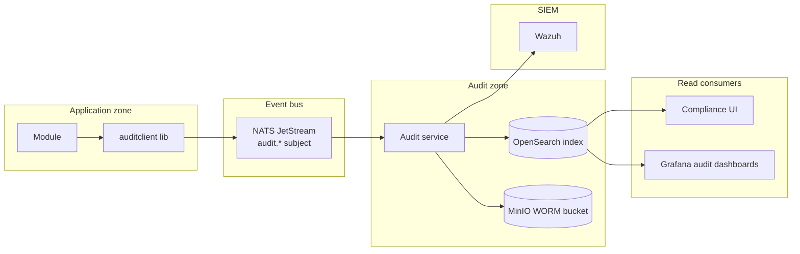

### 32.1 Event shape

```jsonc
{
  "specversion": "1.0",                    // CloudEvents
  "id": "<uuid>",
  "source": "/modules/<module-name>",
  "type": "module.<module-name>.<resource>.<action>",
  "time": "2026-04-30T12:00:00Z",
  "datacontenttype": "application/json",
  "subject": "<resource>/<id>",
  "data": {
    "actor": {
      "userId": "...", "name": "...", "email": "...",
      "employeeId": "...", "roles": ["MANAGER"]
    },
    "action": "<action>",
    "resource": { "kind": "<kind>", "id": "...", "name": "..." },
    "before": { /* prior state */ },
    "after": { /* new state */ },
    "reason": "Free-text description of why",
    "outcome": "success",
    "severity": "INFO",
    "dataClass": "INTERNAL",
    "request": { "id": "...", "ip": "...", "userAgent": "..." },
    "policy": { "cerbosVersion": "...", "decision": "ALLOW" }
  }
}
```

Mandatory fields: actor, action, resource, outcome, severity, dataClass.

### 32.2 Retention

| Severity | DataClass | Retention |
| --- | --- | --- |
| Any | RESTRICTED (financial transactions, customer PII) | **7 years** in WORM, plus index in OpenSearch for 2 years (older queryable via WORM-restore process) |
| WARN+ | CONFIDENTIAL | 3 years |
| INFO+ | INTERNAL | 1 year |
| DEBUG | INTERNAL | 90 days |

### 32.3 Access control

Read access to OpenSearch audit index restricted to the **Compliance** namespace's service accounts and identified compliance staff (via OIDC + SSO). The audit service exposes only `Append` to module pods via Cerbos-enforced gRPC; `Query` and `Export` require a separate role.

WORM bucket is write-only for the audit service; read-only for compliance during investigations; nobody has delete or modify access ever (object-lock prevents it cryptographically).

## 33. SIEM — Wazuh

Wazuh (wazuh.com) is the platform SIEM. Open source, comprehensive, K8s-friendly.

Inputs to Wazuh:
- **Audit stream** from the audit service (subscribe to NATS `audit.*`).
- **Loki tail** for application errors and security-relevant log lines.
- **Falco alerts** (§34) for runtime anomalies.
- **Trivy reports** (§35) for vulnerability findings.
- **Wazuh agent** on every cluster node for FIM (file-integrity monitoring) — limited because Talos is read-only, but covers etcd snapshots and audit egress.

Outputs:
- Real-time security dashboard.
- Alerts to the SOC team.
- Compliance reports (PCI-DSS, ISO 27001) generated on-demand.

## 34. Runtime security — Falco

Falco (falco.org) watches syscall behaviour for anomalies: `unexpected shell in container`, `write to read-only fs`, `outbound connection to unknown IP`. Rules live in a `falco-rules` repo, GitOps-deployed.

Default ruleset: the upstream Falco rules + a small organisation-specific overlay (e.g., "alert on `kubectl exec` into prod namespace pods" — which should never happen).

## 35. Image scanning — Trivy Operator

Aquasec **Trivy Operator** scans every image in the cluster + every Kubernetes resource for misconfiguration. Results show as `VulnerabilityReports` and `ConfigAuditReports` CRDs; piped to Wazuh and to Backstage (per-module scorecard).

CI gate: builds publish to GitLab Registry; before Argo CD promotes an image to prod, the **CI pipeline blocks** if Trivy reports unfixed `HIGH` or `CRITICAL` CVEs unless an explicit waiver exists in the GitOps repo.

## 36. Policy enforcement — Kyverno

Kyverno (kyverno.io) enforces cluster-level policy as code. Examples:

- Every pod must have a `module` label.
- No pod may run as root or with `privileged: true`.
- Images must come from your registry path.
- Images must be signed by the platform Cosign key.
- Resource requests + limits are mandatory.
- NetworkPolicy is required in every namespace.

Policies live in a `k8s-policies` repo; CI tests them on a kind cluster; Argo CD rolls them out.

**Why Kyverno over OPA Gatekeeper**: Kyverno's YAML-based policy language is significantly easier to read/write than Rego for the typical operator population. Gatekeeper is more powerful but the team is usually smaller than OPA's learning curve justifies.

---

## Part VI — Developer Experience

## 37. Source control — GitLab CE

Recommendation: **GitLab Community Edition**, self-hosted on the mgmt cluster, as the single source-of-truth for code, container images, packages, CI pipelines, issues, MRs, and SAST.

### 37.1 Why GitLab CE over alternatives

| Alternative | Verdict |
| --- | --- |
| **GitHub Enterprise Server** | Strong product but commercial. Rejected on cost + no on-prem-OSS posture. |
| **Forgejo + Woodpecker CI + Harbor + ...** | Pure-OSS stitching path. More moving parts, more integration burden. Acceptable but not chosen. |
| **Gitea + Drone CI** | Lightweight; works for tiny teams. Doesn't include container registry, package registry, advanced CI features GitLab bundles. |

GitLab CE is permissively licensed (MIT), bundles everything in one well-documented stack. A future move to GitLab EE for compliance features (audit events, multiple approval rules) is a configuration change, not a migration.

### 37.2 Repository topology

| Repo | Purpose |
| --- | --- |
| `starter-web` | Frontend starter template |
| `starter-api` | Backend starter template |
| `shared-libs` | Shared libraries (audit client, healthcheck, paginate, apperrors, otel, cerbos client) |
| `authz-policies` | Cerbos policy bundle |
| `k8s-policies` | Kyverno policy bundle |
| `falco-rules` | Falco rule overlays |
| `event-schemas` | CloudEvents/Avro schema registry source |
| `dashboards` | Grafana dashboard bundle |
| `helm-charts` | Helm charts shared across modules |
| `gitops-prod` | Argo CD source — production cluster state |
| `gitops-nonprod` | Argo CD source — nonprod cluster state |
| `gitops-mgmt` | Argo CD source — mgmt cluster state |
| `platform-docs` | Platform documentation |
| `<module-name>` | One repo per business module |

## 38. Continuous integration

GitLab CI runners deployed on Kubernetes via the Kubernetes executor. Auto-scaling: runners spawn ephemeral pods per job, deleted on completion.

### 38.1 Pipeline templates

Three included templates, included via `include:` in module `.gitlab-ci.yml`:

- `templates/go-api.yml` — for any `starter-api`-derived module.
- `templates/next-frontend.yml` — for any `starter-web`-derived module.
- `templates/shared-lib.yml` — for libraries.

### 38.2 Standard go-api pipeline stages

```yaml
stages:
  - lint           # golangci-lint
  - test           # go test + testcontainers integration
  - build          # multi-arch container image
  - scan           # Trivy + SAST + secret-scan
  - sign           # Cosign signature + in-toto attestation
  - publish        # push to GitLab Registry
  - update-gitops  # MR to gitops-nonprod with new image tag
```

The final `update-gitops` stage is what makes GitOps work end-to-end: a successful build automatically opens an MR to the nonprod GitOps repo updating the image tag. Argo CD picks up the merge and deploys.

### 38.3 Quality gates

| Gate | Threshold |
| --- | --- |
| Test coverage | ≥ 70% module-wide |
| Vulnerabilities | 0 unfixed CRITICAL or HIGH |
| SAST findings | 0 unfixed HIGH |
| Secret scan | 0 leaked secrets |
| Image size | ≤ 300 MB compressed |
| Cerbos policy tests | 100% pass |

Waivers possible via signed comment in MR; recorded in audit.

## 39. GitOps continuous delivery — Argo CD

Argo CD runs on the mgmt cluster and reconciles three target clusters (prod, nonprod, mgmt itself) from the corresponding GitOps repos.

### 39.1 Deployment model

- **Application of Applications** pattern: a single Argo `Application` per environment points at the GitOps repo's root, which lists per-module `Application` definitions.
- **Sync policy**: automatic sync + self-heal in nonprod; manual sync in prod (gated on a change ticket and human approval in Argo UI).
- **Argo Rollouts** for progressive delivery: prod rollouts default to a 5-step canary (5% → 25% → 50% → 75% → 100% with 5-min soak between steps), aborting on Prometheus alert.
- **Pre-sync hooks** run database migrations.

### 39.2 Promotion flow

```
commit ─▶ CI builds image ─▶ MR to gitops-nonprod (auto-merged on green)
       ─▶ Argo syncs to nonprod ─▶ smoke tests run ─▶ on green, MR to gitops-prod opened
       ─▶ human approves prod MR ─▶ Argo Rollouts canary ─▶ steady state
```

### 39.3 Rollback

`git revert` on the GitOps repo. Argo CD reconciles within seconds. RTO for a bad deploy: under 5 minutes from "we should roll back" to traffic stable on the previous version.

## 40. Container registry and supply-chain security

### 40.1 Registry

GitLab Container Registry (bundled with GitLab CE). One project repository per module image. Registries are mTLS-protected; pulls from cluster require Vault-issued credentials.

### 40.2 Image provenance

Every image:
1. Built in a CI pipeline that records its source commit, build metadata.
2. **Signed with Cosign** using a Vault-Transit-stored key (the platform's release key).
3. **Attested** with **in-toto** SLSA Level 3 attestation: build steps, source materials, environment.

Kyverno enforces: cluster will only pull images signed by the platform release key. An unsigned image cannot run.

### 40.3 SBOM

Each image build emits a **Software Bill of Materials** (CycloneDX format) via Syft, attached as an attestation. Trivy scans the SBOM continuously even after deploy; new CVEs trigger a rebuild via a renovate-style automation.

## 41. Developer portal — Backstage

Backstage (backstage.io, Spotify) becomes the single discovery and operations entry point. Self-hosted on the mgmt cluster.

### 41.1 What Backstage provides

| Feature | What it does |
| --- | --- |
| **Service catalog** | Every module registered with owner, oncall, SLO, dependencies, data class. |
| **Software templates (scaffolder)** | "Create new module" button — see §42. |
| **TechDocs** | MkDocs Material rendered from each repo's `docs/` directory. Architecture, runbooks, ADRs all in one place. |
| **Scorecards** | Per-module health: test coverage, vuln count, SLO achievement, doc freshness. |
| **Search** | Across catalog + docs + code (via GitLab integration). |
| **Plugins** | Argo CD app status, Grafana dashboards, GitLab MR list, PagerDuty incidents — all linked from the module page. |

### 41.2 Catalog model

Each module has a `catalog-info.yaml` in its repo root:

```yaml
apiVersion: backstage.io/v1alpha1
kind: Component
metadata:
  name: my-module-api
  description: My module — backend API
  tags: [go, fiber, postgres, temporal]
  links:
    - url: https://grafana.example.com/d/my-module
      title: Grafana dashboard
spec:
  type: service
  owner: team-platform
  lifecycle: production
  system: my-platform
  dataClass: INTERNAL
  providesApis: [my-module-api-v1]
  consumesApis: []
  dependsOn: [resource:my-module-postgres, resource:temporal-prod]
```

The catalog is the system of record; Argo applications inherit owner from it; PagerDuty rotation lookup uses it.

## 42. Module scaffolder

Backstage software template `create-module` generates a fully wired new module from a form.

### 42.1 What the form asks

- Module name (kebab-case)
- Display name
- Owner team
- Data classification
- Backend technology (Go API / TypeScript service / library)
- Includes Temporal worker? (yes/no)
- Includes scheduled jobs? (yes/no)
- Public API consumers? (none / internal / partner)

### 42.2 What it generates

In one transaction, the scaffolder:

1. Creates GitLab project from the starter template.
2. Customises generated code (module name in `package.json`, Cerbos `resourceKind`, env var names, navigation entries).
3. Opens an MR to `authz-policies` adding a default policy for the new resource kind.
4. Opens an MR to `gitops-nonprod` adding the Argo `Application` definition.
5. Registers the module in Backstage catalog.
6. Provisions a GitLab CI pipeline.
7. Opens placeholder issues for "implement first endpoint", "write first test", "document SLO".
8. Posts a Slack notification to the owner team channel.

Target end-to-end time from form submission to "first deploy in nonprod is live": **5 minutes**.

## 43. Test infrastructure

### 43.1 Frontend

- **Vitest** for unit + component tests. The starter ships with example tests for `FormWrapper`, `PermissionsProvider`, the API client wrapper.
- **Playwright** for end-to-end browser tests. Starter ships with one test per major flow.
- **Storybook** for component visual review.

### 43.2 Backend

- **Go test** with table-driven tests for unit-level coverage.
- **testcontainers-go** spins up real Postgres / Redis / NATS / Temporal in CI. Integration tests run against real services, not mocks.
- **`go-cmp`** for deep equality, **`gomock`** for HTTP-client interfaces only.

### 43.3 Cross-module

- **Pact** for contract testing between modules. Each module publishes its API contract; consumers verify against the published contract before deploying.
- **k6** for load tests. Starter ships a baseline scenario; CI runs it nightly against nonprod.

### 43.4 Cerbos policy testing

`cerbos run --tests` on every PR to `authz-policies`. Tests are YAML fixtures (principal + resource + action + expected decision); coverage measured.

## 44. Documentation strategy

Three layers, none optional:

1. **Per-repo TechDocs** (`docs/` directory in each repo) — architecture, runbooks, ADRs, getting-started. Rendered into Backstage.
2. **Platform docs** (`platform-docs` repo) — this document, ADRs that span multiple repos, runbooks the SRE team owns.
3. **Inline OpenAPI** — every Go API generates OpenAPI 3 from struct tags via `swaggo`. The OpenAPI spec is the source of truth; clients (TS) regenerate from it on every release.

ADRs follow the **Michael Nygard** format: Context, Decision, Status, Consequences. Numbered sequentially per repo.

---

## Part VII — The starter kits

## 45. Frontend — `starter-web`

A Next.js 16 + React 19 module template that ships every pattern an enterprise team needs from day one.

### 45.1 Stack

| Layer | Choice |
| --- | --- |
| Framework | Next.js 16, App Router |
| UI | React 19 |
| Language | TypeScript 5.9 (strict) |
| Styling | Tailwind v4 |
| Components | shadcn/ui (Radix-based) |
| State (server) | TanStack Query 5 (wired in root layout) |
| State (URL) | nuqs |
| Forms | react-hook-form + zod |
| i18n | next-intl |
| Animation | motion (Framer) |
| Tables | TanStack Table |
| Charts | Recharts |
| Lint/format | Biome 2 |
| Test (unit) | Vitest |
| Test (e2e) | Playwright |
| Storybook | 8.x |
| OTel | `@opentelemetry/sdk-trace-web` + browser SDK |

### 45.2 What ships

- **`PermissionsProvider`** at the layout level — single batched Cerbos call returning all permissions for the current page, exposed via `usePermissions()` hook.
- **`NavItem.permission` field** — sidebar items declare required permissions; layout filters server-side.
- **`app/error.tsx` + `app/global-error.tsx` + `app/not-found.tsx`** — error boundaries with proper messaging.
- **`next.config.ts` headers**: CSP, HSTS, X-Frame-Options, X-Content-Type-Options, Referrer-Policy.
- **i18n setup** with English by default; structured to add more locales.
- **`lib/otel/`** — browser tracing initialised in root layout.
- **Full Zod env schema** including `OATHKEEPER_JWT_SECRET`, `OATHKEEPER_ISSUER`, `DEV_JWT_TOKEN`, `CERBOS_GRPC_URL` — fail at startup, not first request.
- **`.env.example`** with placeholders only; no working secrets in version control.
- **Real healthcheck** at `/api/health` that probes module dependencies; returns `{status, dependencies}` JSON.
- **Storybook** with stories for every shared component.
- **Test fixtures** including a working Playwright e2e example.

## 46. Backend — `starter-api`

Go 1.25 + chi, structured for an enterprise-grade module. (The shipped `starter-api` repo wires every Plinth Go SDK package into one working service.)

### 46.1 Stack

| Layer | Choice |
| --- | --- |
| Language | Go 1.25 |
| HTTP | chi |
| Database | sqlc + pgx (no GORM, no AutoMigrate) |
| Migrations | golang-migrate |
| Validation | go-playground/validator |
| Logger | log/slog (stdlib) with JSON handler |
| Errors | `sdk-go/errors` + RFC 7807 problem+json |
| Workflow | Temporal Go SDK *(v1.0 target — not in v0.1.0)* |
| Cerbos | `sdk-go/authz` |
| OTel | `sdk-go/otel` |
| Audit | `sdk-go/audit` |
| Test (unit) | go test |
| Test (integration) | testcontainers-go |
| API spec | swaggo OpenAPI generation |

### 46.2 Layering

Strict three-layer:

```
internal/
├── handlers/      # HTTP — only HTTP concerns; no business logic
├── service/       # business logic — only this layer touches Temporal, audit, cerbos
├── repository/    # data access — sqlc-generated
├── workflows/     # Temporal workflow definitions
├── activities/    # Temporal activity implementations
├── domain/        # entities, value objects, domain errors
├── apperrors/     # error types
├── middleware/    # auth, logger, recovery, request-id, otel
└── platform/      # platform integrations (audit client wiring, cerbos client wiring)
```

Internal package boundaries enforced by `internal/` Go visibility rules; CI runs lints to fail PRs that bypass them.

### 46.3 Standard endpoints every module gets

- `GET /api/health` — liveness
- `GET /api/ready` — readiness (probes DB, Cerbos, Temporal, NATS)
- `GET /metrics` — Prometheus
- `GET /docs` — Swagger UI
- `GET /openapi.json` — spec
- `GET /api/v1/...` — module endpoints

### 46.4 Configuration

A single `config.Config` struct populated by **Viper**, validated by `go-playground/validator`. Fails at startup if any required value is missing; logs the missing field name.

### 46.5 Audit, errors, pagination

- **Audit**: every `service` method annotated to emit the event after success, recording actor/action/before/after to NATS via the audit client.
- **Errors**: domain errors are `apperrors.NotFound`, `apperrors.Conflict`, `apperrors.PermissionDenied`, etc.; the HTTP middleware translates them to RFC 7807 responses.
- **Pagination**: `internal/domain/pagination.go` provides `Pagination` + `PageMeta` types; handlers parse from query string via standard helper.

## 47. Shared libraries

| Lib | Purpose |
| --- | --- |
| `auditclient` | CloudEvents-shaped audit-event publishing to NATS |
| `healthcheck` | Dependency probes (DB, Cerbos, Vault, Temporal, NATS) |
| `paginate` | Standard pagination types and parsing |
| `apperrors` | Typed errors, `errors.Is`-friendly, HTTP mapper |
| `otel` | OTel SDK initialization, propagators, common attributes |
| `cerbosclient` | Single canonical Cerbos client; fail-closed; batched check; decision logging |
| `vault` | Vault client wrapper for KV reads, dynamic creds, transit encrypt/decrypt |
| `temporal` | Temporal client wrapper with platform defaults (interceptors for OTel + audit) |

Each lib is independently versioned (Go modules), tagged in GitLab.

## 48. Authorization-policy repository

`authz-policies` repo houses every authorisation policy for every module.

### 48.1 Why centralise

- **Cross-cutting roles** (e.g., a quality role that can review *any* module) are declared once.
- **Consistency** — every policy follows the same template; reviewers don't context-switch.
- **Compliance evidence** — every policy change is a reviewed PR with audit trail.

### 48.2 Test fixtures

Every resource policy has a sibling `*_test.yaml` enumerating principal/resource/action triples and the expected decision. CI runs `cerbos run --tests`; fail = no merge.

### 48.3 Policy bundle delivery

CI publishes a signed bundle to MinIO. Argo CD watches the bundle reference; Cerbos PDP reloads policies on bundle change without restart. Rollback = revert in git.

---

## Part VIII — Compliance and Operations

## 49. Compliance mapping

Mapping a representative subset of controls to the platform components that satisfy them. The full mapping is maintained in `platform-docs/compliance/control-matrix.md` and reviewed quarterly.

| Framework | Control | Platform component |
| --- | --- | --- |
| ISO 27001 A.5.15 | Access control | Oathkeeper + Cerbos + Vault OIDC; reviews via Backstage scorecard |
| ISO 27001 A.5.31 | Legal/regulatory requirements identification | Compliance team owns control matrix in this doc; Wazuh reports |
| ISO 27001 A.8.5 | Secure authentication | Kratos + MFA via directory provider; mTLS east-west |
| ISO 27001 A.8.7 | Protection against malware | Trivy operator + Falco runtime |
| ISO 27001 A.8.8 | Management of technical vulnerabilities | Trivy + Wazuh + weekly triage SLA |
| ISO 27001 A.8.15 | Logging | OTel logs → Loki + audit service → MinIO WORM |
| ISO 27001 A.8.16 | Monitoring activities | Wazuh SIEM + Falco + Hubble flow logs |
| ISO 27001 A.8.20 | Network security | Cilium NetworkPolicy + VLAN segmentation |
| ISO 27001 A.8.24 | Use of cryptography | Vault Transit + PKI + Cilium WireGuard |
| ISO 27001 A.8.32 | Change management | GitOps (every change = MR) + Argo Rollouts canary + audit |
| Local banking guidelines | Segregation of duties | Cerbos role policies + Argo manual prod approval |
| Local banking guidelines | Audit trail (multi-year) | MinIO object-lock WORM bucket; OpenSearch index |
| Local banking guidelines | Business continuity | Velero + WAL-G + quarterly restore drill |
| PCI-DSS 8 | Identify users and authenticate access | Identical to ISO controls above |
| PCI-DSS 10 | Logging and monitoring | Identical to ISO A.8.15/A.8.16 |
| PCI-DSS 11.4 | Detect and respond to network intrusions | Falco + Wazuh + Cilium Hubble |

## 50. Data classification

Four classes, one set of platform rules:

| Class | Examples | Rules |
| --- | --- | --- |
| **PUBLIC** | Marketing copy, public docs | Any storage; no encryption mandate |
| **INTERNAL** | Project metadata, employee directory entries | Encrypted at rest by default (Vault Transit on PII fields, Ceph encryption on volumes) |
| **CONFIDENTIAL** | Performance reviews, salary data, audit findings | INTERNAL rules + access logged at field level + masked in nonprod |
| **RESTRICTED** | Customer financial data, regulatory submissions | CONFIDENTIAL rules + dedicated namespace + Cerbos checks every read + 7-year retention + annual access review |

Each module declares its `dataClass` in `catalog-info.yaml`; Kyverno enforces that pods labelled with a higher class get stricter policies (e.g., must run in dedicated nodes).

## 51. Backup and disaster recovery

### 51.1 Backup matrix

| What | How | Where | Frequency | Retention |
| --- | --- | --- | --- | --- |
| K8s state (manifests) | git | GitLab | Per change | Indefinite |
| K8s runtime state (PVCs, secrets) | Velero | MinIO `velero` bucket | Hourly | 30 days |
| etcd | Cluster snapshot job | MinIO `etcd-snapshots` | Hourly | 30 days |
| Postgres | CloudNativePG WAL-G | MinIO `pg-backups` | Continuous WAL + daily base | 35 days online, 1 year cold |
| MinIO content | Site-replication to DR site | DR MinIO | Continuous | Per source bucket |
| Vault | Raft snapshot | MinIO `vault-snapshots` | Hourly | 30 days |
| GitLab | GitLab built-in backup | MinIO | Daily | 30 days |
| Audit WORM | Cross-region replication via MinIO replication | DR site | Continuous | Original 7-year retention preserved |

### 51.2 RTO/RPO targets

| Tier | RTO | RPO | Examples |
| --- | --- | --- | --- |
| Tier 1 (audit, identity, secrets) | 1 h | 5 min | Vault, audit service, Cerbos |
| Tier 2 (production modules) | 4 h | 15 min | Application modules |
| Tier 3 (nonprod, mgmt) | 24 h | 24 h | Backstage, GitLab, Grafana history |

### 51.3 DR site

A second physical site at a regulator-approved distance from the primary. Hosts a quiescent K8s cluster + replicated MinIO + standby Vault + Postgres warm standby. Failover via DNS swing + manual confirmation; quarterly drill. Cost is roughly 60% of the primary site (smaller worker count).

### 51.4 Restore drill

Quarterly **chaos day**: pick a Tier 2 module, restore it from backup into a sandbox cluster, verify functional. Outcome documented; gaps fed back as platform issues.

## 52. Incident response

Runbook in `platform-docs/runbooks/incident-response.md`. Highlights:

1. **Detection**: PagerDuty alert from Wazuh / Alertmanager / Falco / customer report.
2. **Triage**: oncall engineer opens incident channel in Slack; bot pulls relevant Grafana dashboards, Hubble flows, recent deploys.
3. **Mitigation**: rollback via `git revert` + Argo sync; or scale; or feature-flag.
4. **Communication**: status page updated; stakeholder Slack channel; per-policy notifications.
5. **Resolution**: incident closed when SLO recovered.
6. **Postmortem**: blameless postmortem template; published in TechDocs; action items tracked as platform issues.

## 53. Secret rotation

| Secret type | Mechanism | Rotation cadence |
| --- | --- | --- |
| Postgres app credentials | Vault dynamic creds | TTL 1 h, rolling |
| Internal mTLS leaf certs | cert-manager | 24 h |
| Internal CA intermediate | Manual via Vault PKI | 1 year |
| Oathkeeper JWT signing key | Dual-key rotation: new key pre-published; old key window 24 h | 90 days |
| Vault root token | Sealed (Shamir 5-of-3); never used except break-glass | N/A |
| GitLab CI tokens | AppRole secret-id rotation | Daily |
| External integration tokens | Manual per vendor SLA | 90 days |

Rotation jobs are Temporal workflows in a **`platform-rotation`** module — durable, observable, retried on failure.

## 54. Vulnerability management

- **Trivy Operator** scans every image and config continuously.
- **Findings** flow to Wazuh + Backstage scorecard.
- **SLA**:

| Severity | Triage SLA | Fix SLA |
| --- | --- | --- |
| CRITICAL | 4 h | 7 days |
| HIGH | 1 day | 30 days |
| MEDIUM | 7 days | 90 days |
| LOW | 30 days | next release |

- **Waivers** require security-team approval, recorded in audit.
- **Renovate** opens MRs for dependency updates weekly; CRITICAL CVEs trigger immediate MR.

---

## Part IX — Roadmap

A 28-week plan in five phases. Phases overlap where dependencies allow; the roadmap below shows critical-path durations.

## 55. Phase 0 — substrate (weeks 1–4)

**Goal**: cluster substrate ready for platform services.

| Week | Activity |
| --- | --- |
| 1 | Hardware procurement kickoff (8-week lead time runs in parallel; reuse existing hardware where possible for Phase 0 PoC); rack power/network design; VLAN allocation |
| 1–2 | Talos PoC on a 3-node test cluster (existing or virtualized); Cilium install; MetalLB; cert-manager; basic Traefik |
| 2 | mgmt cluster bring-up (Talos + Cilium + Traefik + MetalLB + Rook-Ceph + MinIO) |
| 3 | Vault HA cluster; Vault PKI roots + intermediate; cert-manager wired to Vault |
| 3–4 | GitLab CE on mgmt; runners on K8s; first repos created |
| 4 | Backstage skeleton; catalog import from existing GitLab |

**Exit criteria**: mgmt cluster running; Vault, GitLab, Backstage reachable; an engineer can clone a repo and push to a runner.

## 56. Phase 1 — platform services (weeks 5–10)

**Goal**: observability and stateful platform services live.

| Week | Activity |
| --- | --- |
| 5 | OpenTelemetry Collector deployment; Prometheus + Thanos; Loki; Tempo; Pyroscope; Grafana |
| 5–6 | First platform dashboards; Alertmanager rules; PagerDuty integration |
| 6 | CloudNativePG operator; first managed Postgres cluster; PgBouncer |
| 7 | NATS JetStream cluster; Schema Registry repo + CI |
| 7 | Cerbos PDP cluster + `authz-policies` repo + CI test pipeline |
| 8 | Ory Kratos + Hydra deployment; directory federation tested |
| 8–9 | OpenSearch cluster (operator); audit-service PoC writing to OpenSearch + WORM bucket |
| 9 | nonprod cluster bring-up |
| 10 | prod cluster bring-up (mirroring nonprod config from GitOps repo); end-to-end smoke test |

**Exit criteria**: a hello-world module deployed to nonprod can authenticate, authorise, persist, log, trace, and emit an audit event end-to-end.

## 57. Phase 2 — workflow + security (weeks 11–16)

**Goal**: workflow engine and security stack production-ready.

| Week | Activity |
| --- | --- |
| 11 | Temporal cluster (Helm chart); first sample workflow; OTel + audit interceptors |
| 12 | Audit service v2: NATS subscriber, OpenSearch indexer, MinIO WORM writer, retention scheduler |
| 13 | Wazuh deployment; Loki + audit + Falco inputs configured |
| 13 | Falco DaemonSet on prod + nonprod; rule overlays |
| 14 | Trivy Operator; CI gate enforcement; Cosign + in-toto signing pipeline |
| 14–15 | Kyverno policies; baseline enforcement (no-root, no-privileged, image-signature, network-policy required) |
| 15 | Argo CD on mgmt; Argo Rollouts; first GitOps app reconciled |
| 16 | DR site provisioning (parallel to other phases); MinIO site replication |

**Exit criteria**: full platform stack live; security tooling alerting; DR site receiving replication.

## 58. Phase 3 — starter kits + first migration (weeks 17–22)

**Goal**: starter kits shipped; first module ported to them.

| Week | Activity |
| --- | --- |
| 17–18 | `shared-libs` v2 (auditclient, paginate, apperrors, otel, cerbosclient, vault, temporal) |
| 18–19 | `starter-api` (Go, Temporal-wired, sqlc, golang-migrate, OTel, structured errors); golden-path example resource |
| 18–19 | `starter-web` (Next.js, PermissionsProvider, error boundaries, security headers, i18n, Storybook, tests) |
| 20 | Backstage scaffolder template for `create-module`; end-to-end test |
| 21 | Pilot module migration kickoff (parallel team): port frontend to starter; rewrite workflow logic on Temporal; write Cerbos policy bundle |
| 22 | Pilot module in nonprod; data migration job for in-flight workflows; UAT with stakeholders |

**Exit criteria**: pilot module in nonprod stable; scaffolder generates a runnable module in <5 min.

## 59. Phase 4 — fleet rollout (weeks 23–28)

**Goal**: every existing module on the new starter; legacy platform decommissioned.

| Week | Activity |
| --- | --- |
| 23 | Pilot module prod canary (10%); progressive rollout |
| 23–24 | Pilot module prod 100%; legacy version frozen |
| 24–26 | Remaining modules ported (parallel teams using scaffolder) |
| 26 | DR drill on new platform; restore pilot module from backup in DR site |
| 27 | Security audit (third-party); penetration test |
| 27–28 | Compliance evidence pack assembly; ISO/regulator review |
| 28 | Legacy platform decommissioned; stakeholder closeout |

**Ongoing after week 28**: Backstage scorecards baseline; quarterly DR; annual penetration test; secret rotation as scheduled; dependency upgrades via Renovate.

## 60. Cost and effort summary

### 60.1 Headcount (FTE-equivalents during the 28 weeks)

| Role | Phase 0 | Phase 1 | Phase 2 | Phase 3 | Phase 4 |
| --- | --- | --- | --- | --- | --- |
| Platform / SRE | 3 | 3 | 3 | 2 | 2 |
| Backend engineers | 0 | 1 | 1 | 3 | 4 |
| Frontend engineers | 0 | 0 | 0 | 2 | 2 |
| Security engineer | 0.5 | 1 | 2 | 1 | 1 |
| QA / test engineering | 0 | 0 | 1 | 1 | 2 |
| Compliance / audit liaison | 0.25 | 0.25 | 0.5 | 0.5 | 1 |

### 60.2 Cash cost summary

| Item | Cost (USD, indicative) |
| --- | --- |
| Hardware (§7) | ~$413,000 CAPEX |
| OSS licences | $0 |
| Optional commercial support (Talos/Sidero, Temporal Cloud, Cerbos Hub) — recommended for Tier 1 components in year 1 | $50,000–$120,000/yr |
| Training (HashiCorp, Temporal, Backstage) | $25,000 |
| Third-party security audit + pen test | $40,000 |
| Contingency (15%) | $80,000 |

## 61. Risks and mitigations

| Risk | Probability | Impact | Mitigation |
| --- | --- | --- | --- |
| Temporal learning curve slows Phase 3 | Medium | Schedule slip | Vendor training in Phase 1; spike on workflows in Phase 2 |
| Talos's no-SSH model rejected by ops culture | Medium | Forced replatform | Phase 0 PoC with operator participation; if rejected, fall back to RKE2 |
| Hardware lead time exceeds 8 weeks | Medium | Phase 0 slip | Run Phase 0 PoC on existing hardware; formally enter Phase 1 only when delivered |
| Audit/compliance team unfamiliar with new tooling | Low | Audit blocker | Compliance liaison embedded from week 1; quarterly framework reviews |
| Open-source component goes unmaintained | Low | Tech debt | Every choice has documented alternative (recorded in this doc); CNCF/Apache-foundation projects preferred |
| Cilium upgrade breaks workloads | Low | Outage | nonprod canary one minor version ahead; rollback via Argo |
| Vault outage takes down the platform | Low | Tier-1 outage | HA Raft cluster + DR replica + dynamic-cred TTL longer than typical incident-resolution time |

---

## Part X — Diagrams

The diagrams below are reference Mermaid sources. Source `.mmd` files are in the `diagrams/` subdirectory and lint-checked in CI.

## 62. Logical architecture diagram

(See §5 for the rendered version.) Source: `diagrams/01-logical-architecture.mmd`.

## 63. Network topology diagram

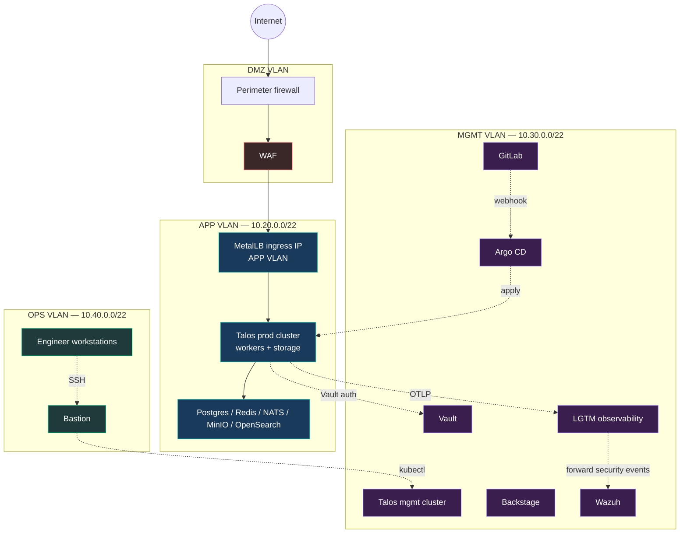

## 64. Cluster topology diagram

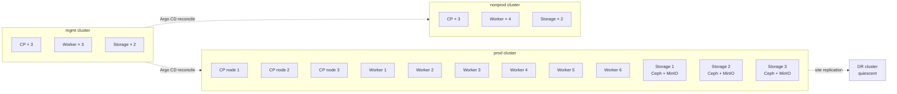

## 65. Request lifecycle diagram

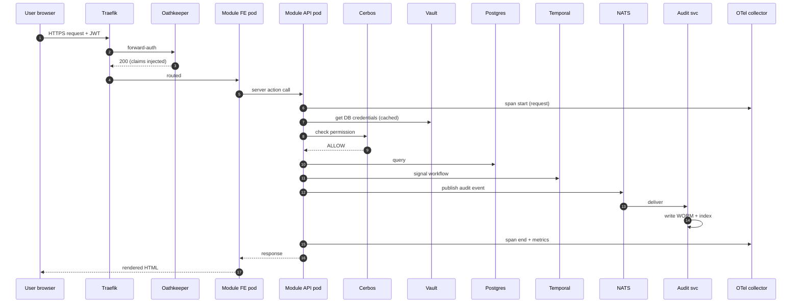

## 66. Workflow engine sequence diagram

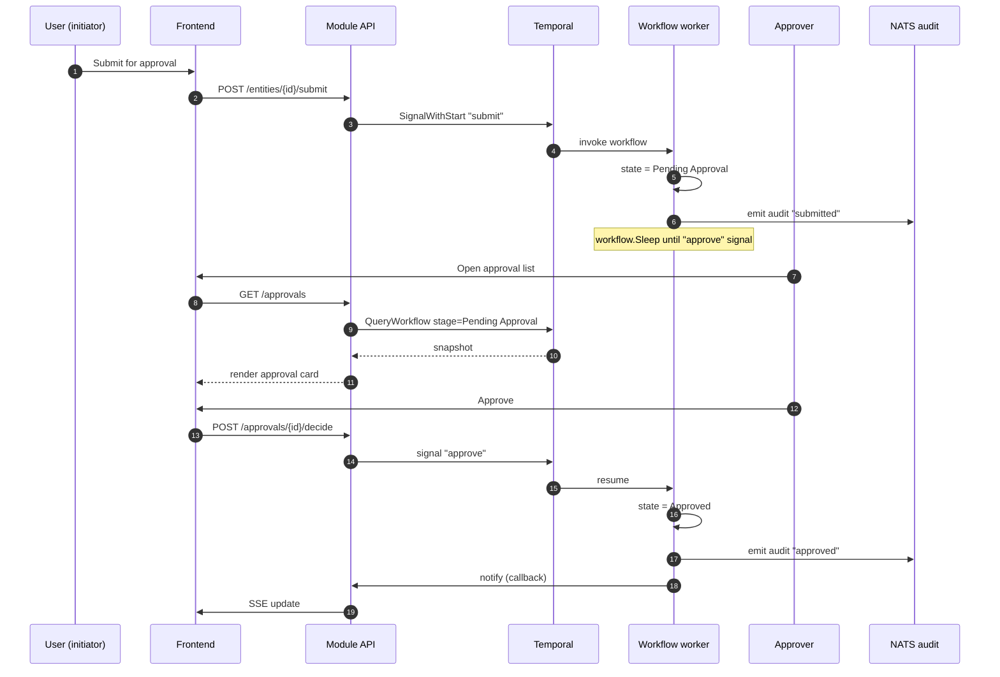

## 67. CI/CD pipeline diagram

```mermaid
flowchart LR
    classDef good fill:#1e3a3a,stroke:#10b981,color:#fff
    classDef gate fill:#3a2828,stroke:#f87171,color:#fff
    classDef deploy fill:#1A3A5C,stroke:#14B8A6,color:#fff

    DEV[Developer push] --> MR[Merge request]
    MR --> LINT[Lint]:::good
    LINT --> TEST[Unit + integration tests]:::good
    TEST --> BUILD[Build container]:::good
    BUILD --> SCAN[Trivy + SAST + secret-scan]:::gate
    SCAN -- pass --> SIGN[Cosign sign + in-toto attest]:::good
    SIGN --> PUSH[Push to GitLab Registry]:::good
    PUSH --> GOPS[Open MR to gitops-nonprod]:::deploy
    GOPS --> ARGO_NP[Argo CD nonprod sync]:::deploy
    ARGO_NP --> SMOKE[Smoke + E2E]:::good
    SMOKE -- pass --> GOPS_PR[Open MR to gitops-prod]:::deploy
    GOPS_PR --> APPR[Manual approval]:::gate
    APPR --> ARGO_P[Argo CD prod canary]:::deploy
    ARGO_P --> CANARY[5% → 25% → 50% → 75% → 100%]:::deploy
    CANARY --> STEADY[Steady state]:::good

    SCAN -- fail --> BLOCK[Block + notify]:::gate
    SMOKE -- fail --> BLOCK
    APPR -- reject --> BLOCK
```

## 68. Secret-rotation flow diagram

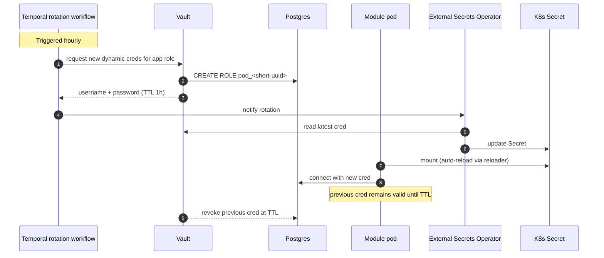

## 69. Audit-log lifecycle diagram

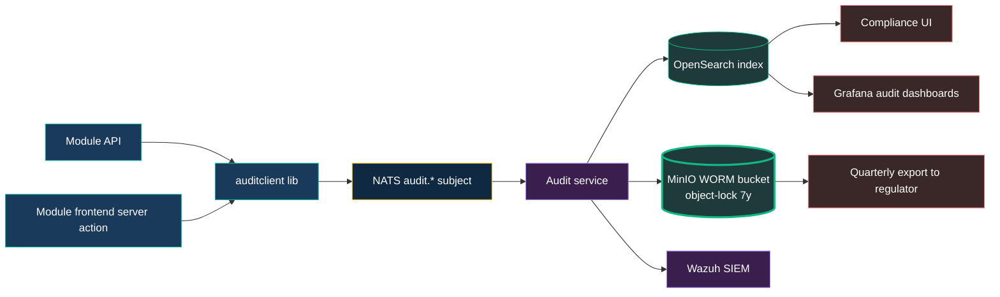

## 70. Identity flow diagram

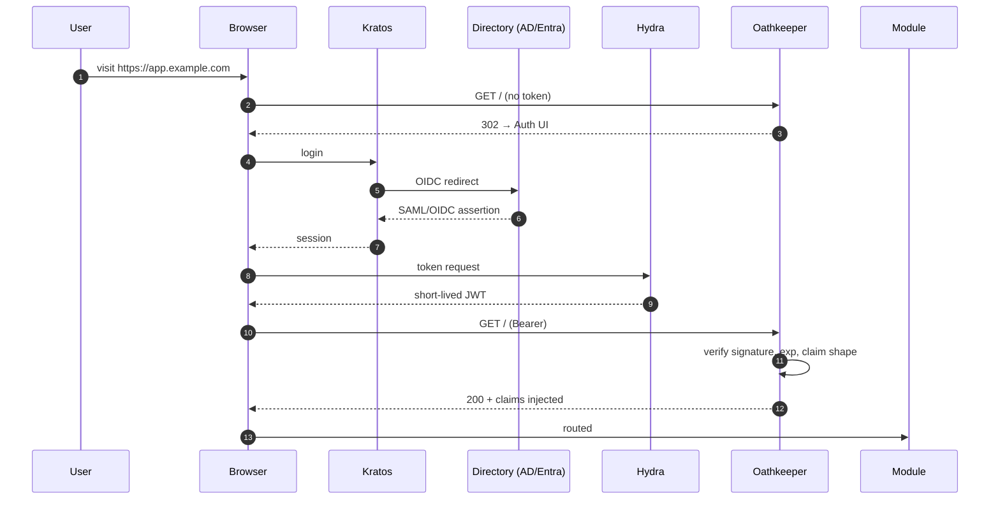

## 71. Backup and DR flow diagram

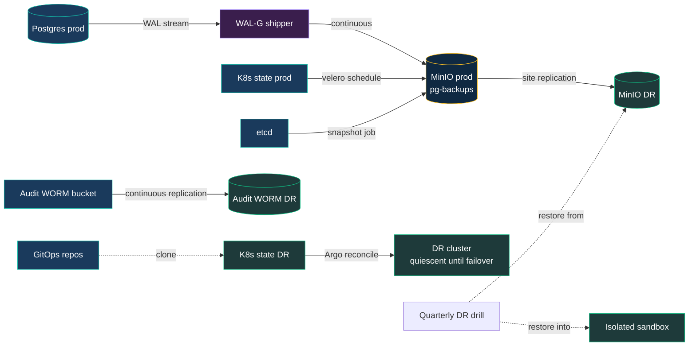

---

## 72. Glossary

| Term | Definition |
| --- | --- |
| **BoM** | Bill of Materials |
| **Cerbos** | Open-source authorisation service used as the platform's policy decision point |
| **CRD** | Custom Resource Definition (Kubernetes) |
| **DR** | Disaster Recovery |
| **GitOps** | Operational pattern where the desired state of a system is declared in git and reconciled by an agent |
| **JWT** | JSON Web Token |
| **Kratos / Hydra / Oathkeeper** | Three Ory components used here for identity / OAuth / gateway-auth |
| **LGTM** | Loki, Grafana, Tempo, Mimir — the Grafana observability stack family |
| **NATS** | Lightweight message broker; JetStream is its persistence layer |
| **OTel / OTLP** | OpenTelemetry / OpenTelemetry Protocol |
| **PoC** | Proof of Concept |
| **RPO / RTO** | Recovery Point Objective / Recovery Time Objective |
| **SBOM** | Software Bill of Materials |
| **SIEM** | Security Information and Event Management |
| **SLA / SLO** | Service Level Agreement / Service Level Objective |
| **SPIFFE / SPIRE** | Standards/runtime for issuing workload identities |
| **Talos** | Sidero's API-managed Kubernetes operating system |
| **Temporal** | Open-source durable workflow engine |
| **WORM** | Write-Once-Read-Many storage |

---

## 73. License

Released under MIT. Use, fork, adapt — no obligations.

*End of document.*
